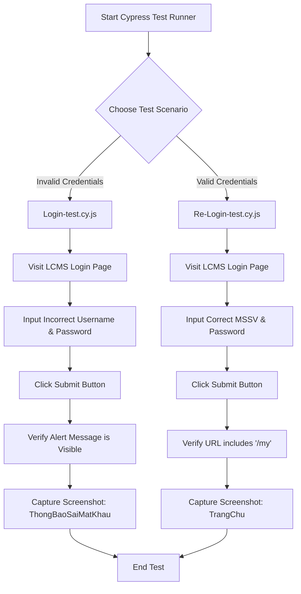
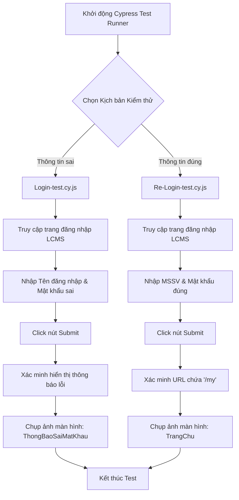

  <h1>🧪 Test Automation E2E Login - LCMS NTTU</h1>
  <h3>Software Testing Project - Cypress E2E Testing</h3>

  

    
    
    
    
    
  

  

    <i>[Tiếng Việt bên dưới / Vietnamese version below]</i>
  

<h2>🇺🇸 English Version</h2>

### 1. Overview
This project implements an automated End-to-End (E2E) testing suite for the login system of the LCMS (Learning Content Management System) at Nguyen Tat Thanh University (NTTU). Built entirely with **Cypress** and **JavaScript**, this automation framework aims to evaluate the reliability and performance of the authentication process.

**Cypress** plays a critical role in this project by providing a fast, reliable, and developer-friendly testing environment that runs directly in the browser. It enables real-time interaction with the DOM, allowing us to accurately simulate user behaviors and validate the system's responses.

### 2. Objectives
- **Automated Verification**: Seamlessly test the login functionality to ensure valid users are granted access while invalid attempts are appropriately rejected.
- **UI & Experience Testing**: Validate that proper alert messages are displayed to users when incorrect credentials are provided.
- **Reporting & Debugging**: Capture screenshots automatically upon test completion (e.g., successful login dashboard or error alerts) for efficient debugging and quality assurance documentation.

### 3. Test Execution Process

### 4. Project Structure

| File / Folder | Type | Description |
| :--- | :---: | :--- |
| **`Login-test.cy.js`** | Test Script | Validates the login process with invalid credentials and captures the error alert. |
| **`Re-Login-test.cy.js`** | Test Script | Validates the successful login process and verifies redirection to the dashboard. |
| **`Final-Quality.docx` / `.pdf`** | Documentation | The comprehensive software testing report detailing the Cypress framework analysis. |
| **`Final-Quality.pptx` / `.pdf`** | Presentation | Slides used for the final project defense. |

### 5. Test Scenarios

- ❌ **Negative Test (Login-test.cy.js)**: 
  - **Action**: The system navigates to the login page and inputs an invalid `Username` and `Password`.
  - **Expected Result**: An error alert with the `.alert` class is displayed. The script logs the error text and captures a screenshot named `ThongBaoSaiMatKhau`.

- ✅ **Positive Test (Re-Login-test.cy.js)**: 
  - **Action**: The system navigates to the login page and inputs valid credentials (`MSSV` and actual password).
  - **Expected Result**: The user is successfully authenticated, the URL updates to include `/my`, and a screenshot of the dashboard named `TrangChu` is captured.

### 6. Getting Started

1. **Prerequisites**: Ensure you have [Node.js](https://nodejs.org/) installed on your machine.
2. **Installation**: Clone this repository and open it in your terminal. Run `npm install cypress --save-dev` to install Cypress.
3. **Configuration**: Open the test files (`Login-test.cy.js` and `Re-Login-test.cy.js`) and update the mock credentials (`Ten-dang-nhap`, `Mat-khau`, `MSSV`, `PASSWORD`) if necessary.
4. **Execution**: Run `npx cypress open` to launch the Test Runner GUI. Select the test specification you wish to execute.
5. **Results**: Review the execution logs, view the captured screenshots in the `cypress/screenshots` directory, and verify the assertions.

### 7. Team Members
**Team Quality (4 members)**
- Pham Nguyen Phuc An
- Tran Nguyen Quoc Anh
- Nguyen Thi Thanh Tam
- Ngo Thi Thuy Trang

**Instructor:** Dr. Tran Son Hai, PhD

---

<h2>🇻🇳 Tiếng Việt</h2>

### 1. Tổng quan
Dự án này triển khai bộ kiểm thử tự động End-to-End (E2E) cho hệ thống đăng nhập của LCMS (Learning Content Management System) tại Trường Đại học Nguyễn Tất Thành (NTTU). Được xây dựng hoàn toàn bằng **Cypress** và **JavaScript**, framework tự động hóa này nhằm đánh giá độ tin cậy và hiệu năng của quá trình xác thực người dùng.

**Cypress** đóng vai trò cực kỳ quan trọng trong dự án này nhờ cung cấp môi trường kiểm thử nhanh chóng, ổn định và thân thiện với lập trình viên, chạy trực tiếp trên trình duyệt. Nhờ Cypress, hệ thống có thể tương tác trực tiếp với DOM, cho phép mô phỏng chính xác hành vi người dùng và xác minh phản hồi của hệ thống.

### 2. Mục tiêu đề tài
- **Xác thực tự động**: Kiểm thử liền mạch chức năng đăng nhập để đảm bảo người dùng hợp lệ được cấp quyền truy cập, trong khi các nỗ lực đăng nhập sai bị từ chối thích hợp.
- **Kiểm thử Giao diện & Trải nghiệm**: Xác minh rằng các thông báo lỗi phù hợp được hiển thị cho người dùng khi cung cấp thông tin đăng nhập không chính xác.
- **Báo cáo & Gỡ lỗi**: Tự động chụp ảnh màn hình sau khi hoàn thành kiểm thử (ví dụ: trang chủ khi đăng nhập thành công hoặc cảnh báo lỗi) phục vụ cho tài liệu đảm bảo chất lượng và gỡ lỗi.

### 3. Quy trình thực thi kiểm thử

### 4. Cấu trúc dự án

| Tệp / Thư mục | Loại | Mô tả |
| :--- | :---: | :--- |
| **`Login-test.cy.js`** | Kịch bản Test | Kiểm tra quá trình đăng nhập với thông tin sai và chụp lại thông báo lỗi. |
| **`Re-Login-test.cy.js`** | Kịch bản Test | Kiểm tra quá trình đăng nhập thành công và xác minh chuyển hướng đến trang chủ. |
| **`Final-Quality.docx` / `.pdf`** | Tài liệu báo cáo | Báo cáo chi tiết về đồ án phân tích công cụ kiểm thử Cypress. |
| **`Final-Quality.pptx` / `.pdf`** | Bài thuyết trình | Slide sử dụng cho buổi bảo vệ đồ án cuối kỳ. |

### 5. Kịch bản Kiểm thử (Test Scenarios)

- ❌ **Kiểm thử Tiêu cực (Login-test.cy.js)**: 
  - **Hành động**: Hệ thống truy cập trang đăng nhập và nhập `Username` và `Password` không hợp lệ.
  - **Kết quả mong đợi**: Cảnh báo lỗi với lớp `.alert` được hiển thị. Script sẽ ghi log nội dung lỗi và chụp ảnh màn hình với tên `ThongBaoSaiMatKhau`.

- ✅ **Kiểm thử Tích cực (Re-Login-test.cy.js)**: 
  - **Hành động**: Hệ thống truy cập trang đăng nhập và nhập thông tin hợp lệ (`MSSV` và mật khẩu thật).
  - **Kết quả mong đợi**: Người dùng được xác thực thành công, URL thay đổi có chứa `/my` và ảnh màn hình trang chủ được chụp lại với tên `TrangChu`.

### 6. Hướng dẫn cài đặt

1. **Yêu cầu hệ thống**: Đảm bảo bạn đã cài đặt [Node.js](https://nodejs.org/) trên máy tính.
2. **Cài đặt**: Clone repository này và mở trong terminal. Chạy lệnh `npm install cypress --save-dev` để cài đặt Cypress.
3. **Cấu hình**: Mở các tệp kiểm thử (`Login-test.cy.js` và `Re-Login-test.cy.js`) và cập nhật các thông tin đăng nhập mẫu (`Ten-dang-nhap`, `Mat-khau`, `MSSV`, `PASSWORD`) nếu cần.
4. **Thực thi**: Chạy lệnh `npx cypress open` để mở giao diện Test Runner. Chọn file spec bạn muốn chạy.
5. **Kết quả**: Xem lại log chạy test, kiểm tra các ảnh màn hình được lưu trong thư mục `cypress/screenshots` và xác minh các assertion.

### 7. Thành viên nhóm
**Nhóm Quality (4 thành viên)**
- Phạm Nguyễn Phúc Ân
- Trần Nguyễn Quốc Anh
- Nguyễn Thị Thanh Tâm
- Ngô thị Thùy Trang

**Giảng viên hướng dẫn:** TS. Trần Sơn Hải

